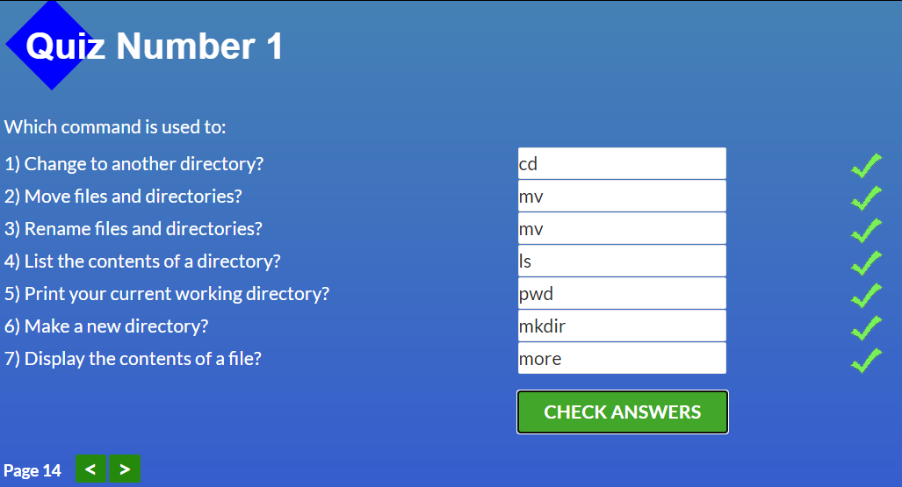
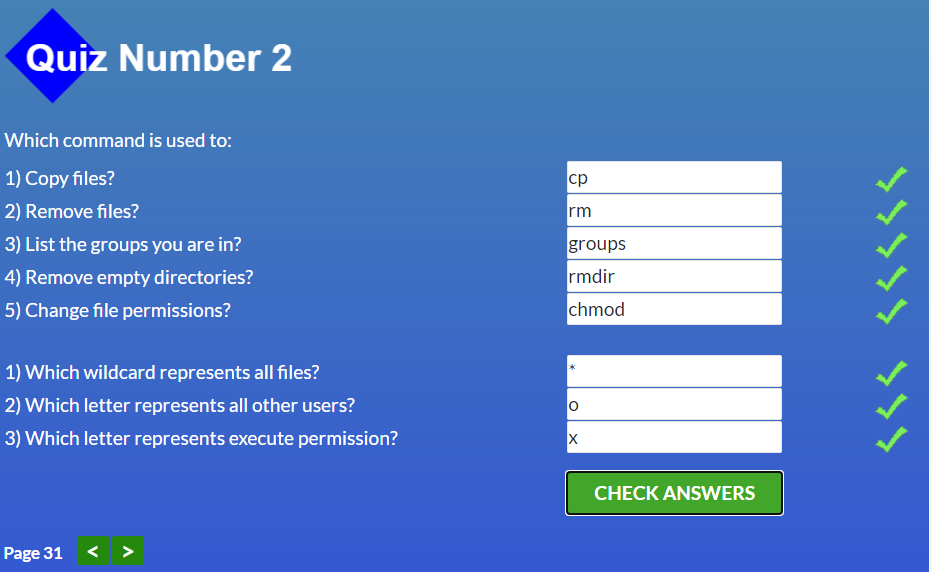
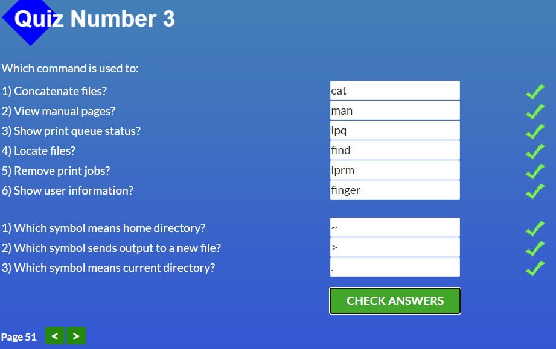
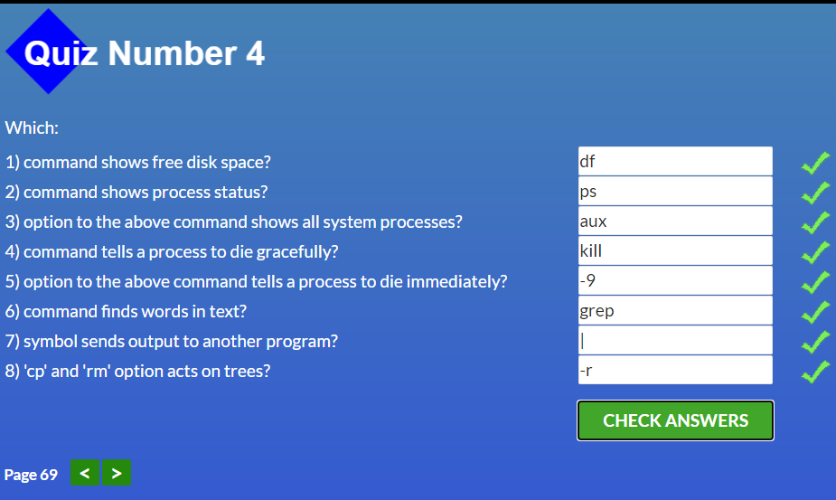
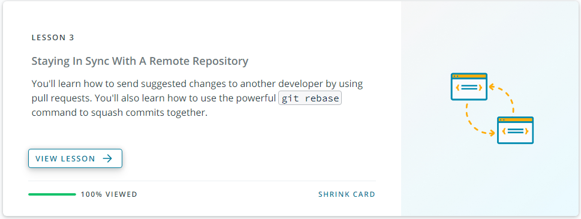
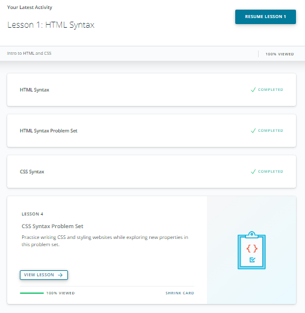
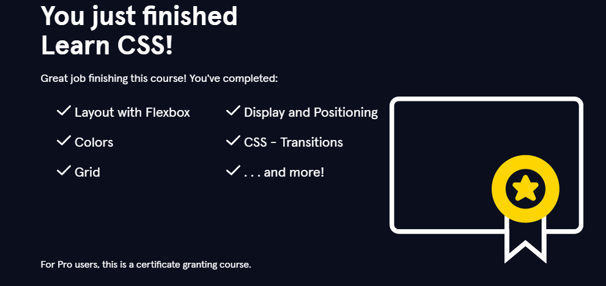
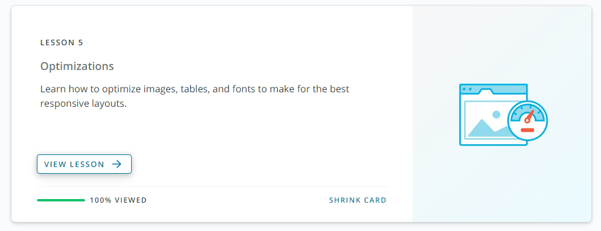
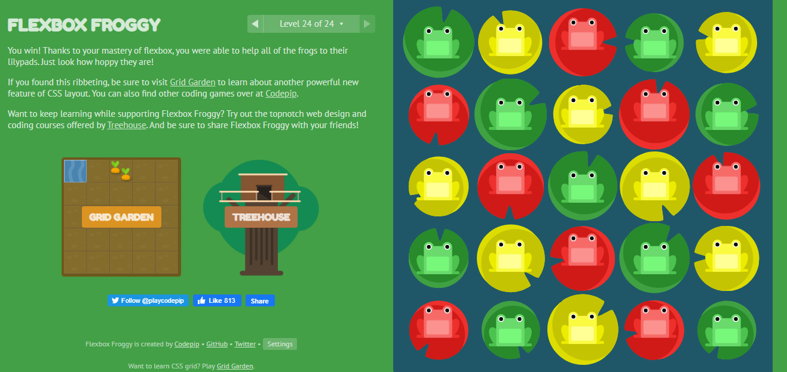

# kottans-frontend
***   

### Contents

### Stage 0. Self-Study  
#####  <em> Preparatory stage of Front-End Course. Following tasks should be completed to join main course.</em>  
***
###  General 
- [Git Basics](#gitintro),[DONE]
- [Linux CLI, and HTTP](#Linux), [DONE]
- [Git Collaboration](#Git_collab); [DONE]

***
  
### Front-End Basics   
   
- [Intro to HTML and CSS](#html-css), [DONE]   
- [Responsive Web Design ](#resp_web), [DONE]
+ HTML & CSS Practice  
+ JavaScript Basics  
+ Document Object Model - practice 
*** 
### Advanced Topics  
  
+ Building a Tiny JS World (pre-OOP) - practice  
+ Object oriented JS - practice  
+ OOP exercise - practice  
+ Offline Web Applications  
+ Memory pair game — real project!  
+ Website Performance Optimization  
+ Friends App - real project!  
***    
***
## Stage 1. The Show Must Go On    
  
#####  <em> Main part of the Front-End Course. </em>

## Lectures & Workshops  
    
### HTML, CSS & DOM  

+ W3C and WHATWG Standards. HTML markup. Intro to CSS. Grids.  
+ Graphics on the web. А11Y & forms. Content handling  
+ DOM and Layout Trees  
+ Cookies, document.cookie  
***
### JavaScript  
+ Scopes & Closures  
+ Concept of this  
+ Prototypes  
+ Types & Grammar  
+ Callbacks & Promises  
+ Async & Await  
+ ESNext Api / Generators  
+ Functionality  
+ How browser works/Web workers  
***  
### Frontend Framework  
***  
### TypeScript    
***
### Soft Skills  

***

<a name="gitintro"><h2>Git Intro</h2></a> 

  ####  <em>After completing this course I discovered many new commands for myself in Git. It turns out that I didn't know this topic well.</em>
  

  
 

  

***  

<a name="Linux"><h2>Linux CLI, and HTTP</h2></a>

####  <em>Refreshed my knowledge of Linux commands and had a good time reading about http protocols. A lot of information that I did not know and still learn. Also I learned about printer control commands and others that I had not used before</em>  

  
  
  
    

***

<a name="Git_collab"><h2>Git Collaboration</h2></a>
   
#### <em>I know the necessary commands and operations, but not all of them, and therefore I will practice and review the materials. A very useful thing. Thanks</em>
####  I didn't know commands like <b>Fetch, Rebase, Cherry-pick,</b> and others that I will definitely use in my work in the feature.

   

***
  

<a name="html-css"><h2>Intro to HTML and CSS</h2></a>

####  <em>I've never used a grid before. Flex also has always been a problem and remains difficult for me.</em>

    

***

 

<a name="resp_web"><h2>Responsive Web Design</h2></a>  

  ###  <em>It was a lot of fun to play with frogs.</em>
  

    

  

***  

  

