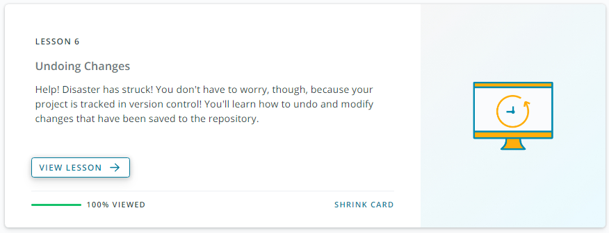
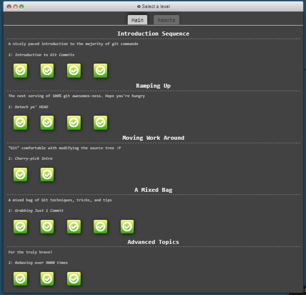
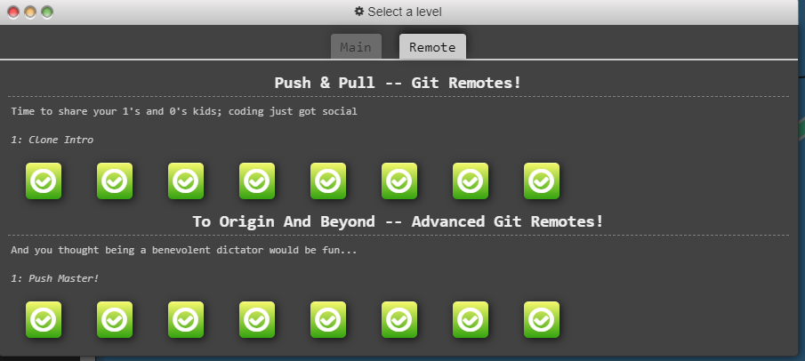

# kottans-frontend
***   

### Contents

### Stage 0. Self-Study  
#####  <em> Preparatory stage of Front-End Course. Following tasks should be completed to join main course.</em>  
***

###  General 
- [Git Basics](#gitintro),[DONE]
- [Linux CLU](#Linux),  
+ VCS (hello gitty), GitHub and Collaboration  

***
  
### Front-End Basics   
   
+ Intro to HTML & CSS    
+ Responsive Web Design  
+ HTML & CSS Practice  
+ JavaScript Basics  
+ Document Object Model - practice 
*** 
### Advanced Topics  
  
+ Building a Tiny JS World (pre-OOP) - practice  
+ Object oriented JS - practice  
+ OOP exercise - practice  
+ Offline Web Applications  
+ Memory pair game — real project!  
+ Website Performance Optimization  
+ Friends App - real project!  
***    
***
## Stage 1. The Show Must Go On    
  
#####  <em> Main part of the Front-End Course. </em>

## Lectures & Workshops  
    
### HTML, CSS & DOM  

+ W3C and WHATWG Standards. HTML markup. Intro to CSS. Grids.  
+ Graphics on the web. А11Y & forms. Content handling  
+ DOM and Layout Trees  
+ Cookies, document.cookie  
***
### JavaScript  
+ Scopes & Closures  
+ Concept of this  
+ Prototypes  
+ Types & Grammar  
+ Callbacks & Promises  
+ Async & Await  
+ ESNext Api / Generators  
+ Functionality  
+ How browser works/Web workers  
***  
### Frontend Framework  
***  
### TypeScript    
***
### Soft Skills  
<<<<<<< HEAD
  
    
      
    -
***
## <a name="gitintro">Git Intro</a> 

  ###  <em>After completing this course I discovered many new commands for myself in Git. It turns out that I didn't know this topic well.</em>
  
 

  

***  

## <a name="Linux">Linux CLU</a>
=======
